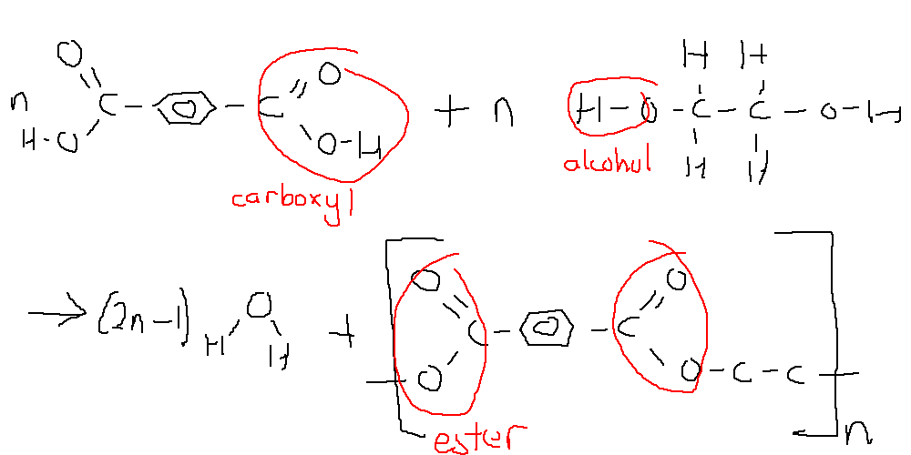

Polymers
========

.. admonition:: Syllabus Excerpt

    **Inquiry Question:** What are the properties and uses of polymers?

   * model and compare the structure, properties and uses of addition polymers of ethylene and related monomers, for example:

     * polyethylene (PE)

     * polyvinyl chloride (PVC)

     * polystyrene (PS)

     * polytetrafluoroethylene (PTFE)

   * model and compare the structure, properties and uses of condensation polymers, for example:

     * nylon

     * polyesters

    |syllabus-nesa|_

Polymers are long molecules made up of repeating units called :term:`monomers<monomer>`.
These monomers react in a process called *polymerisation*, where the introduction of a free radical opens up a C=C double bond and this propogates down a chain of the monomers until the chain hits a terminating free radical or the end of another chain (this is mostly out of syllabus).
The process propogates amongst thousands (as many as 20,000) of molecules as the polymer structure lowers the total energy of the system and is thus preferred.

Polymers can be broken down into two categories by how they form: addition polymers and condensation polymers.

Addition Polymers
-----------------

Addition Polymers form from the reaction of a single monomer with itself (for example, ethene to polyethene).

In this process the double bond is broken and becomes a single bond. In the case where the monomer chain is longer than a single double bond, it can be treated as a n-thyl substitute group off a repeating ethene unit:

Addition Polymers are named as ``poly<monomer>``, e.g. *propene* -> *polypropene*.

As part of this course we need to learn about the addition polymers of:

* :ref:`polyethlyene` (PE)

* :ref:`polyvinyl chloride` (PVC)

* :ref:`polystyrene` (PS)

* :ref:`polytetrafluoroethylene` (PTFE)

Condensation Polymers
---------------------

Condensation polymerisation occurs between monomers with functional groups on either end that will react with the other monomers.
Condesation polymers can form copolymers, that is, a polymer derived from two different monomers. 
Condensation polymerisation also forms a secondary, much smaller molecule, which is often water. **Do not** forgot to add this when doing condensation polymerisation reactions in your exams.

The presence of functional groups in condensation polymers often give them stronger intermolecular forces, and they also tend to form more crystallines structures (more on this later).

As part of this course we learn about:

* :ref:`nylon`

* :ref:`polyester`

Structure, Properties, and Uses
-------------------------------

The properties of polymers can be analysed through intermolecular forces, as well as the crystallinity of the chains.
The different structures provide the IMF as well as help crystallinity, as well as how they form.
The different uses of each polymer arise from each property. 
Care should be taken such that the properties mentioned in your response justify the uses (i.e. "high boiling point" is not a good reason for why PVC is used in water pipes).

Polymers can be orientated or unorientated crystalline, or amorphous.

.. list-table::
    :width: 90%
    :align: center

    * - Orientated Crystalline
      - Unorientated Crystalline
      - Amorphous

    * - .. image:: images/crystalline.png
      - .. image:: images/unorientated-crystalline.png
      - .. image:: images/amorphous.png

Amorphous polymers have weak intermolecular bonds, and hence have low boiling points as well as low tensile strengths.
They experience plastic deformation where chains easily slip past each other.
There is often lots of branched chains which further decrease the packing ability of molecules.

Unorientated Crystalline polymers form naturally when monomers contain strong intermolecular bonds and are linear.
This increases the packing ability and thus increases the tensile strength and boiling points of the polymer.
They are a mix of crystalline sections orientated in varying directions.

Orientated Crystalline polymers do not generally form as a result of a chemical reaction. 
Instead they occur as the result of a cold drawing process, which pulls out the unorientated crystalline chains.
This results in much higher tensile strengths and is used for the production of ropes and fibres.

Polymers can also be classified as elastomers, thermoplastic (thermosoftening), or thermosetting.
All the polymers covered in the course exist as thermoplastics (generally - polyesters can sometimes by thermosetting).

Thermoplastics have only intermolecular forces between polymer chains (dispersion, dipole-dipole, and hydrogen bonds), which when heated will break apart, and thus the polymer will melt and can be remoulded.

Thermosets contain cross-links, which are intramolecular bonds between polymer chains - these require a cross-linking agent such as sulphur (in vulcanisation).
The existence of cross links prevents the molecules from stretching elastically.
When heating a thermosetting polymer, bonds within the carbon chain will often break before the cross-links do, resulting in the decomposition of the polymer.

.. warning::
    It should be noted the difference between as "highly elastic" polymer and an "elastomer". 
    Elastomers are highly amorphous polymers which, when stretched, form crystalline structures that are of a significantly different shape to the original molecule (perhaps >20% elongation).
    They need to contain cross-links which do not favour being stretched and create the favoured initial shape.
    They are unable to maintain this crystalline structure in the absence of a tensile force, and hence it is entropically favourable for them to revert to their original shape.
    This is perhaps what one would consider to be "elastic", but **it is not**.

    Elastic is an engineering term used to describe materials which can revert back to their original shape.
    Most materials are elastic - even steel - up to their elastic limit.
    Past the elastic limit, they plastically (i.e. permanently) deform to a different shape and eventually break at their tensile strength.
    What perhaps a better description for "elastic" would be "stiff", and this is expressed through the modulus of elasticity (Young's Modulus) - stress over %elongation.

    Highly elastic materials will retain their elasticity even with large amounts of force applied to them (elastomers plastically deform after a certain amount of force).
    For example, natural rubber (an elastomer) has a modulus of elasticity of ~0.1GPa, whilst nylon 6,6 has a modulus of elasticity of ~3GPa - nearly 30x more.

.. note::
    A good resource on polymers is `this book from libretexts <https://chem.libretexts.org/Bookshelves/Organic_Chemistry/Book%3A_Basic_Principles_of_Organic_Chemistry_(Roberts_and_Caserio)/29%3A_Polymers>`_.
    Whilst much of it is out of syllabus, it gives a good background on the properties and structure of various polymers.

Polyethylene
^^^^^^^^^^^^

Polyethylene forms from the addition reaction between monomers of ethene.

Without a catalyst, it forms the branched low-density polyethlyene, which is lightweight (as the chains pack horribly). It contains only weak dispersion forces holding the molecules together, and is amorphous.

It is used for plastic bags and food containers as it is *lightweight* and *flexible*, and does not affect food contents, and is also insoluble in water (non-polar), resistant to some chemical attack (strong C-H and C-C bonds).

In the presence of a Ziegler-Natta catalyst, the chains form crystalline structures which allow for stronger dispersion forces between polymer chains. This gives it higher density and strength.

HDPE is used for buckets, milk crates, and pipes as it is reasonably strong and hard (due to crystallinity and strong DP), light (low molecular weight), and insoluble (non-polar), resistant to some chemical attack (strong C-H and C-C bonds)

Polyvinyl Chloride
^^^^^^^^^^^^^^^^^^

The addition of a chlorine atom to form chloroethene creates the polymer polyvinyl chloride, commonly referred to as PVC.
It tends to be rather amorphous as it forms mainly *atactic* PVC - that is, the chlorine atoms are randomly arranged on either side of the chain.
This makes it difficult for chains to pack close together.

However, as the Cl is more electronegative than carbon, it attracts electrons, which make it slightly negative and the carbon slightly positive.
This forms a permanent dipole and results in stronger intermolecular forces between chains, increasing the boiling point despite the amorphous nature.
It also makes the chain very rigid and strong.

It is still insoluble in water as it is only weakly polar.

The C-Cl bond has a lower bond energy than C-H, meaning that it is more prone to decomposition in UV light (e.g. in the sun) but this it prevented with an inhibitor such as TiO2.

It has no shared lone pair electrons and is hence electrically non-conductive.

Plasticisers can be added to the molecule to reduce the strength of intermolecular bonds and hence make it flexible.

As PVC is rigid and water insoluble, it can be used in water piping.
As it is electrically nonconductive, and flexible, it finds use in electrical insulation.
As it can be flexible and water insoluble, and does not decompose under UV, it is used in garden hoses.

Polystyrene
^^^^^^^^^^^

A styrene monomer contains a bulky benezene ring which decreases packing ability but makes the polymer quite polar.

Just like PVC, polystyrene mainly forms atactic forms, with the benzene rings randomly arranged on either side of the molecular.
This reduces the linearity of chains and hence it would not have as strong intermolecular forces as expected (though they are still quite strong).
The structure is amorphous.

The polar benzene ring serves to make the molecular very rigid, which results in it being brittle.
The low packing ability makes polystyrene have a low density.

As it is a very rigid molecule, this makes it suitable for use in computer cases, CD/DVD cases, and battery cases.

It can also be turned into a foam, which is filled with air molecules.
These air molecules make it very low density and also a good thermal insulator.

Polytetrafluoroethylene
^^^^^^^^^^^^^^^^^^^^^^^

PTFE, also known by the brand name Teflon, is made from the polymerisation of tetrafluroethene.

The C-F bonds that the polymer contains are highly electronegative.
Each attached fluorine atom is strongly repulsed by each other, and hence the structure has one preferred shape (no rotation around bonds).
The chain forms a very straight rod which (in 3D) gently spirals.

As the chains are very straight, this forms a crystalline structure.
The dispersion forces produced between molecules are very strong because the molecules are so closely packed (despite the repulsion from fluorine atoms), which gives it a boiling point of ~327C.

PTFE gets its non-stick properties and unreactive properties from the strength of the C-F bond; it is very difficult (practically impossible) for any other molecule to replace the C-F bond; as well as most molecules or branched polymers do not pack tight enough to overcome the repulsive fluorine atoms.

The non-stick and inert properties make it useful for frying pans, gears, and medical implants.

.. note::
    ChemGuide produces a `nice explanation <https://www.chemguide.co.uk/qandc/ptfe.html>`_ on the properties of PTFE.

Nylon
^^^^^

Nylon is a type of polyamide formed from the reaction between dicarboyxlic acids and diamines.

A common example of a nylon polymer is nylon 6,6 which is produced with the reaction of hexanedioic acid and hexane-1,6-diamine.

The initial polymer is formed as unorientated crystalline but when cold-drawn into ropes the crystalline structures becomes orientated.

The amide groups in the chains are polar and can form hydrogen bonds between chains. The strong intermolecular forces results in high boiling points as well as making it hard to stretch the chain - resulting in a high elasticity (modulus elasticity = ~3GPa) and high elastic limit (>60MPa).

The high tensile strength of the nylon means that it can be used for rope, fishing lines, and other fibres.

When not cold-drawn (solid), the hydrogen bonds afford the structure rigidity which allows it to be used in gears or bearings.

Polyester
^^^^^^^^^

Polyesters are formed by combining dicarboyxlic acids and diols.

A common polyester is polyethene terephthalate (PET), which is made from benzenen-1,4-dioc acid and ethane-1,2-diol.

The C=O bond formed in the polyester is polar and this allows dipole-dipole interactions to occur, this combined with mostly linear chains creates a highly crystalline structure that affords it high strength and boiling points.

The high strength means it is often formed into clothes or parachutes, through cold-drawing.

Polyesters are susceptible to attack by alkaline substances (the C=O reacts)

As this does not have cross-links, it is a thermoplastic polymer, which means it can be melted into a mould and can be used in packaging. It is suitable for this as it is very recyclable and has a high strength to weight ratio.