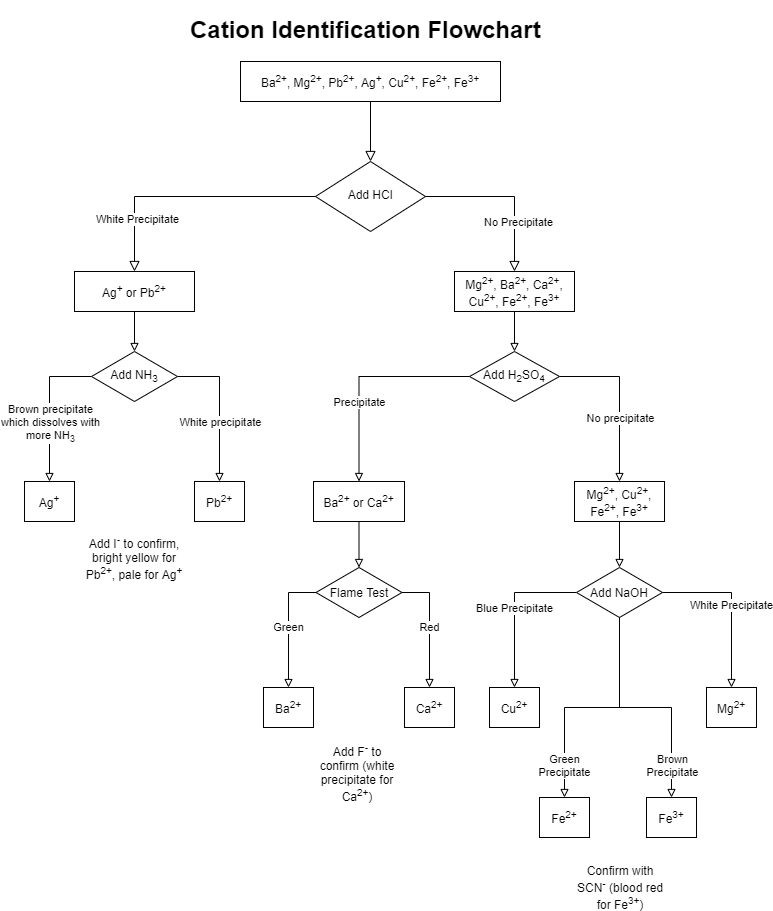
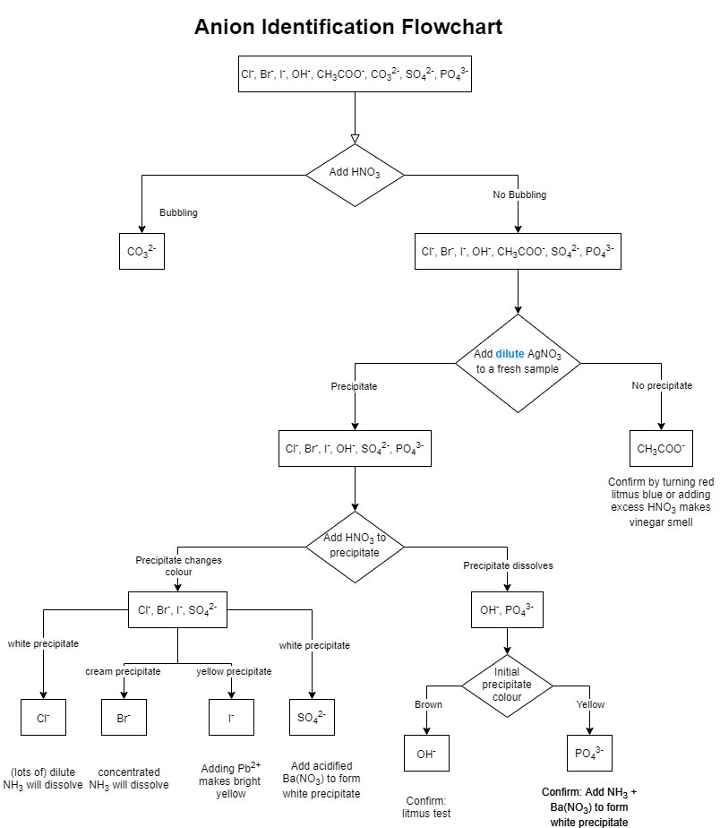

Analysis of Inorganic Substances
================================

Analyse the need for monitoring the environment
-----------------------------------------------

Qualitative investigations to test for the presence of aqueous ions
-------------------------------------------------------------------

..
   Note: These diagrams are draw.io diagrams embedded in PNG.
   Open the PNG with draw.io if you wish to edit it, and DO NOT COMPRESS THESE IMAGES

Cations: |Ba2+|, |Ca2+|, |Mg2+|, |Pb2+|, |Ag+|, |Cu2+|, |Fe2+|, |Fe3+|
^^^^^^^^^^^^^^^^^^^^^^^^^^^^^^^^^^^^^^^^^^^^^^^^^^^^^^^^^^^^^^^^^^^^^^

Anions: |Cl-|, |Br-|, |I-|, |OH-|, |CH3COO-|, |CO32-|, |SO42-|, |PO43-|
^^^^^^^^^^^^^^^^^^^^^^^^^^^^^^^^^^^^^^^^^^^^^^^^^^^^^^^^^^^^^^^^^^^^^^^

.. |Ba2+| replace:: Ba\ :sup:`2+`
.. |Ca2+| replace:: Ca\ :sup:`2+`
.. |Mg2+| replace:: Mg\ :sup:`2+`
.. |Pb2+| replace:: Pb\ :sup:`2+`
.. |Cu2+| replace:: Cu\ :sup:`2+`
.. |Fe2+| replace:: Fe\ :sup:`2+`

.. |Ag+|  replace:: Ag\ :sup:`+`
.. |Fe3+| replace:: Fe\ :sup:`3+`

.. |Cl-| replace:: Cl\  :sup:`-`
.. |Br-| replace:: Br\  :sup:`-`
.. |I-|  replace:: I\   :sup:`-`
.. |OH-| replace:: OH\  :sup:`-`

.. |CO32-| replace:: CO\ :sub:`3`\ :sup:`2-`
.. |SO42-| replace:: SO\ :sub:`4`\ :sup:`2-`
.. |PO43-| replace:: PO\ :sub:`4`\ :sup:`3-`

.. |CH3COO-| replace:: CH\ :sub:`3`\ COO\ :sup:`-`
